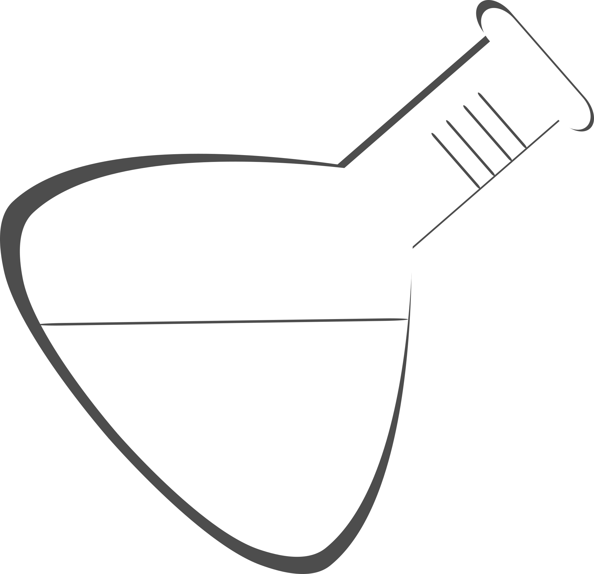

--- 
title: 'Open Science: An Introduction for Biology'
date: "`r Sys.Date()`"
site: bookdown::bookdown_site
documentclass: book
description: An introductory, undergraduate text on the theory and principles of Open
  Science, produced for for the Biology Department at the University of British Columbia,
  Okanagan.
bibliography: OS-Basics.bib
biblio-style: apalike
link-citations: yes
---

# (PART\*) OS 101 {-}

# Welcome {-}

This text was built to accompany the first year of the Biology undergraduate degree program at UBC Okanagan. It's aim is to introduce learners to core considerations in the pursuit of open scientific practices. It's divided into three sections, the first exploring principles and concepts associated with Open Science, the second and third looking at these principles and concepts in practice.

Part 1, *Principles of Open Science* will be covered in BIOL 116. Parts 2 and 3, *Open Science in Action: Benefits* and *Open Science in Action: Challenges*, will be covered in BIOL 125.

Parts 2 and 3 are pending release.

<!-- Global site tag (gtag.js) - Google Analytics -->

## Copyright {-}

This work is licenced under the Creative Commons [Attribution-NonCommercial-ShareAlike 4.0 International (CC BY-NC-SA 4.0)](https://creativecommons.org/licenses/by-nc-sa/4.0/)

Please use the following for citing this document:

Hanna, S., Pither, J., Vis-Dunbar, M. (2021). *Open Science. An introduction for Biology*. [https://ubco-biology.github.io/OS-Introduction/](https://ubco-biology.github.io/OS-Introduction/)

All source files are available [https://github.com/ubco-biology/OS-Introduction](https://github.com/ubco-biology/OS-Introduction).

## Conventions {-}

Glyhps:

|      |      |
| ---- | ---- |
|  | Lab exercises for discussion |
|  | Examples of principles in practice |
|  | Highlight of UBC researcher engaged or participating in Open Science |

